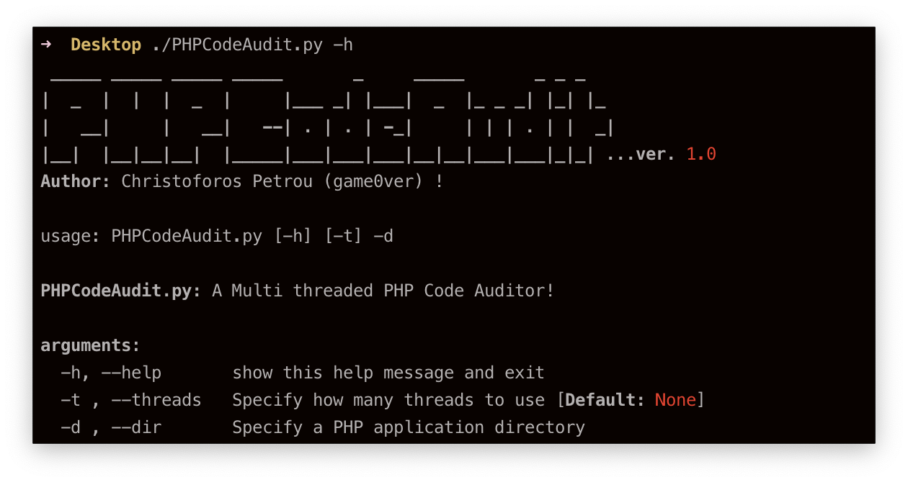
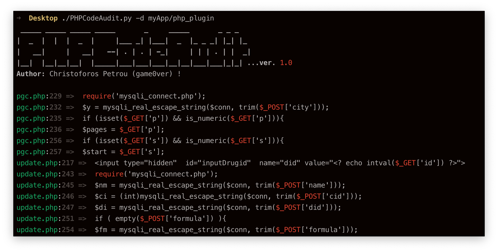

# PHPCodeAudit 
 

This is a standalone python script that makes the process of locating potential vulnerable/exploitable PHP functions (_most of the functions are taken from [this great stackoverflow answer](https://stackoverflow.com/questions/3115559/exploitable-php-functions/3697776#3697776)_) in PHP projects easy!

### Example:

#### **Note:** To install the requirements:
---
`pip install -r requirements.txt --upgrade --user`

### Disclaimer
> This tool is only for testing and academic purposes and can only be used where strict consent has been given. Do not use it for illegal purposes! It is the end user’s responsibility to obey all applicable local, state and federal laws. Developers assume no liability and are not responsible for any misuse or damage caused by this tool and software.

## License

This project is licensed under the GPLv3 License - see the [LICENSE](LICENSE) file for details